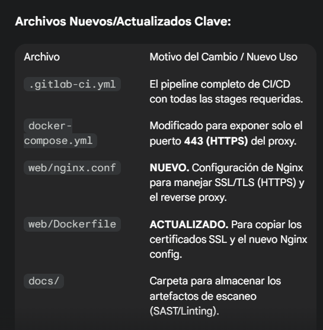
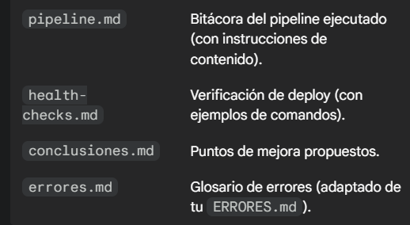

# TPI-devops-pt2

archivos modificados y que se modifico:

NOTA IMPORTANTE: Para que la solución funcione, debes generar un certificado auto-firmado y colocar los archivos en una carpeta web/certs/ antes de construir la imagen de web/.
# 1. Crear la carpeta para los certificados
mkdir -p web/certs

# 2. Generar un certificado auto-firmado (válido por 365 días)

probe:  docker run --rm -v ${PWD}/web/certs:/certs alpine/openssl req -x509 -newkey rsa:4096 -keyout /certs/nginx.key -out /certs/nginx.crt -days 365 -nodes -subj "/C=AR/ST=BA/L=CABA/O=LabSis/OU=DevOps/CN=localhost"
y ese lo creo
## Resumen
Con estos archivos, tienes un nuevo repositorio que:

Implementa CI/CD con .gitlab-ci.yml.

Aplica SAST (detect-secrets, checkov, trivy) para análisis de vulnerabilidades y secretos.

Garantiza HTTPS en el único puerto expuesto (8080->443) mediante Nginx.

Cumple con la documentación solicitada (pipeline.md, health-checks.md, errores.md, conclusiones.md).

Asegúrate de configurar las variables de entorno de GitLab CI/CD (CI_REGISTRY_USER, CI_REGISTRY_PASSWORD, SSH_USER, SSH_HOST, SSH_PRIVATE_KEY y las credenciales de MySQL)